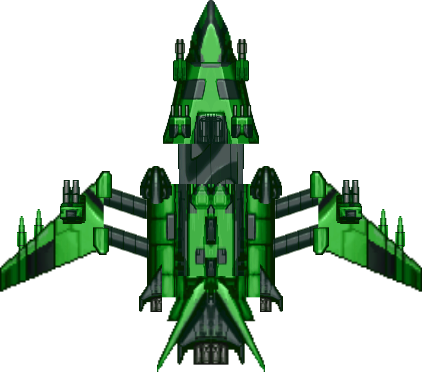

# Galaxy-Dodge

## Second line

### Third line


- hello this is a game where you have to:

  - dodge the rockets falling.
  - **spacebar** to shoot the rockets down.
  - if you hit the rockets it's:

- `__________GAME OVER__________`




> testing

```py
def draw_particles(particles):
    for particle in particles:
        t = particle['life_progress']
        r = int(YELLOW[0] + (ORANGE_RED[0] - YELLOW[0]) * t)
        g = int(YELLOW[1] + (ORANGE_RED[1] - YELLOW[1]) * t)
        b = int(YELLOW[2] + (ORANGE_RED[2] - YELLOW[2]) * t)
        color = (max(0, min(255, r)), max(0, min(255, g)), max(0, min(255, b)))
                
        pygame.draw.circle(screen, color, (int(particle['x']), int(particle['y'])), int(particle['size']))
```